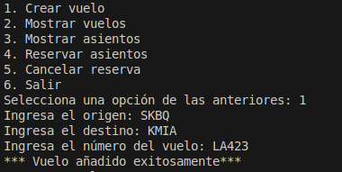
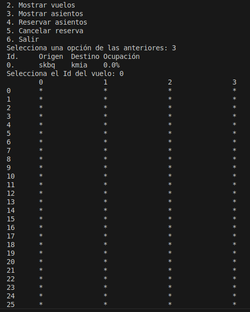
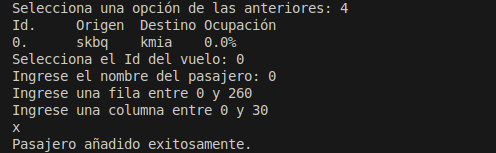
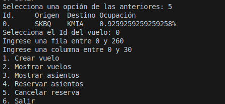

# Instrucciones de Instalación y Ejecución:
1. git clone "url"
2. python3 main.py
# Uso del Programa:
El programa funciona por terminal, para comenzar, presiona la opción 1 para crear un vuelo, aquí
el programa te pedirá ingresar datos como origen, destino y número del vuelo.
Una vez hayas hecho esto, puedes comenzar reservando asientos para un pasajero.
- 1. Crear vuelo: se encarga de crear un vuelo.
- 2. Mostrar vuelos: muestra todos los vuelos que has creado.
- 3. Mostrar asientos: te pide un id de vuelo para revisar los asientos, los libres aparecen como '*' y los seleccionados como 'x'
- 4. Reservar asientos: te pide el nombre del pasajero, la fila y columna dónde se desea hacer la reserva.
- 5. Cancelar reserva: te pide el id del vuelo, la fila y la columna para poder realizar la cancelación.
# Ejemplos
## Crear vuelo

## Mostrar asientos

## Reservar asiento

## Cancelar reserva

